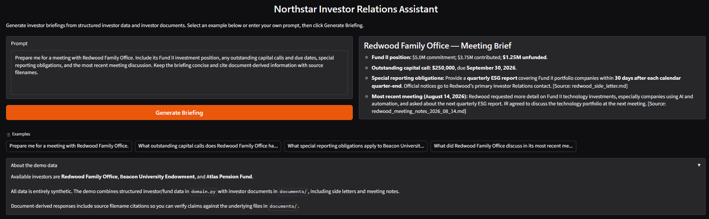
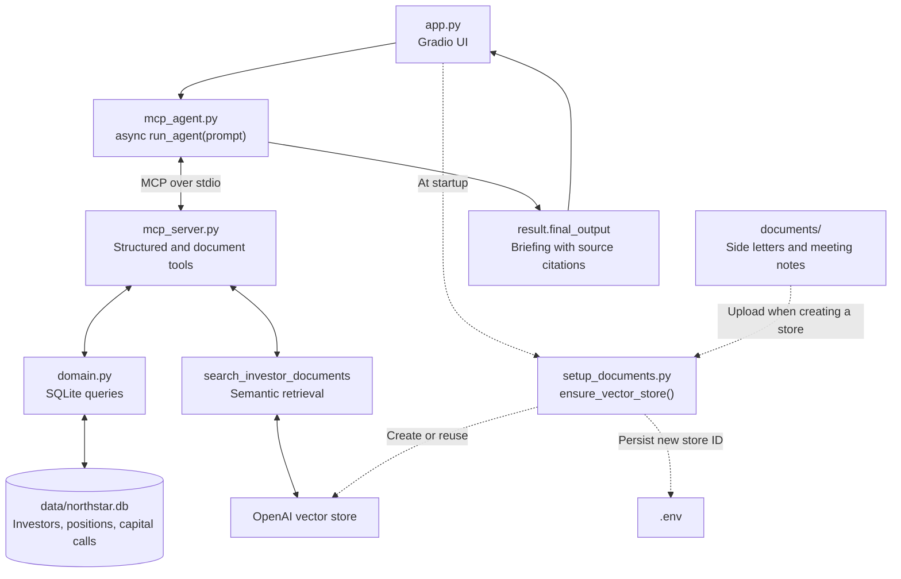

# GP Investor Relations Agent

An AI-assisted application for investor meeting preparation at Northstar Capital,
a fictional private-markets general partner (GP). An investor-relations user can
ask for a briefing that brings together fund positions, capital calls, reporting
obligations and recent meeting context. The local prototype combines deterministic
SQLite-backed data tools and semantic document retrieval through MCP, with source
attribution for document-backed claims.

## What It Does

The workflow addresses a concrete investor-relations task: gathering financial
records, side-letter obligations and prior discussion points before an investor
meeting. Its scope is read-only briefing preparation for an IR professional to
review.

In the Gradio UI, enter a natural-language request or select an example, click
**Generate Briefing**, and read the synthesized response. Clickable examples and
an expandable description of the demo data help a new user explore the available
questions. The UI includes a progress indicator and brief error messages, with
debugging details in the terminal.



Example questions supported by the included data:

- Prepare me for a meeting with Redwood Family Office. Include its investment
  position, outstanding capital calls, special reporting obligations, and most
  recent meeting discussion.
- What outstanding capital calls does Redwood Family Office have?
- What special reporting obligations apply to Beacon University Endowment?
- What did Redwood Family Office discuss in its most recent meeting?

## Architecture



For each request, `mcp_agent.py` starts `mcp_server.py` as a subprocess using the
same Python interpreter. The OpenAI Agents SDK discovers and invokes the
server's tools over standard input/output; the MCP connection closes after the
run. Structured results and retrieved document excerpts return to the agent for
synthesis.

Structured operational data flows from SQLite through `domain.py` functions to
MCP tools. Unstructured investor documents remain in `documents/` and are uploaded
to an OpenAI vector store for semantic retrieval through an MCP tool. The agent
chooses tools and combines their results; the Gradio UI lets the user run the
workflow.

For a meeting-preparation request, the agent can resolve the investor, retrieve
positions and capital calls, search for relevant side-letter and meeting-note
context, then assemble a briefing. The model selects the tools and their
arguments; the tool implementations determine how the requested data is retrieved.

## Design Decisions

- **Structured facts through deterministic tools.** `find_investor`,
  `get_positions`, and `get_capital_calls` call `domain.py` functions that query
  `data/northstar.db` using parameterized SQL. The model chooses which capabilities
  to invoke; application code supplies the authoritative values for this demo. This keeps financial data
  access behind domain functions rather than asking the model to infer balances
  from prose or giving it arbitrary data access.
- **Document context through retrieval.** `search_investor_documents` uses
  semantic search in an OpenAI vector store for side-letter terms and meeting
  context. It prefixes the query with the investor name, then filters results to
  filenames containing the first word of that name, returning at most three
  matching results. This is simple prototype context scoping, not an
  authorization boundary.
- **MCP as the capability interface.** Both structured tools and document search
  are exposed through the same MCP server. MCP provides tool discovery and
  invocation; domain functions and vector-store search perform the actual data
  access. Business logic remains separate from agent configuration.
- **Source attribution.** Search results preserve file IDs, filenames, relevance
  scores, and text. The agent is instructed to cite each material document-derived
  claim as `[Source: filename]`, making it inspectable against the source file.
  Citation compliance is instruction-based and is not independently validated.
- **Reuse across entry points.** The Gradio UI in `app.py` and the command-line
  example in `mcp_agent.py` both call `await run_agent(prompt)`. The UI renders
  `result.final_output` as Markdown, adding a user-facing workflow around the
  same agent configuration, MCP connection, retrieval and citation instructions.

## Data and Documents

**All business data is synthetic. Northstar Capital and every investor are
fictional.** [data/northstar.db](data/northstar.db) stores investor IDs, names and
types; positions in Northstar Growth Fund II with commitment, contributed and
unfunded amounts; and capital calls with amounts, due dates and statuses.

| Investor | Structured coverage | Documents |
| --- | --- | --- |
| Redwood Family Office | Investor record, fund position, outstanding capital call | [Side letter](documents/redwood_side_letter.md); [August 14, 2026 meeting notes](documents/redwood_meeting_notes_2026_08_14.md) |
| Beacon University Endowment | Investor record, fund position, paid capital call | [Side letter](documents/beacon_side_letter.md); [July 20, 2026 meeting notes](documents/beacon_meeting_notes_2026_07_20.md) |
| Atlas Pension Fund | Investor record only; no position or capital-call records | None |

The four Markdown documents contain reporting obligations and meeting discussion
context. To inspect an answer, compare financial values with the SQLite database
(or its synthetic seed data in [create_database.py](create_database.py)) and
document-derived claims with the cited files in [documents/](documents/).
The agent is instructed to acknowledge unavailable information.

## Project Structure

```text
app.py               Gradio interface over run_agent(prompt)
mcp_agent.py         Async agent entry point, instructions and MCP client setup
mcp_server.py        MCP tools for structured records and document search
domain.py            Domain/data-access functions that query SQLite
data/northstar.db     SQLite database containing synthetic operational records
create_database.py   Optional database recreation/reset with synthetic seed data
setup_documents.py   Reuses or creates a vector store; saves new ID to .env
test_search.py       Manual vector-store search inspection; loads .env
function_agent.py    Earlier direct function-tool example, outside the UI path
documents/           Two synthetic side letters and two meeting-note files
requirements.txt     Python dependencies
.env.example         Empty configuration placeholders to copy into .env
.gitignore           Excludes the virtual environment, .env and Python caches
```

## Running Locally

Use Python 3.10+ and PowerShell:

```powershell
git clone https://github.com/HectorFraireSanchez/gp-investor-relations-agent.git
cd gp-investor-relations-agent
python -m venv .venv
.\.venv\Scripts\Activate.ps1
python -m pip install -r requirements.txt
Copy-Item .env.example .env
```

Edit `.env` to add your own API key. Leave the vector-store ID blank on first setup:

```dotenv
OPENAI_API_KEY=your-openai-api-key
OPENAI_VECTOR_STORE_ID=
```

Start the application:

```powershell
python app.py
```

At startup, `app.py` calls `ensure_vector_store()` from `setup_documents.py`.
It reuses the configured store if it exists. If no ID is configured, or OpenAI
reports that the configured store was not found, it creates a store, uploads the
files in `documents/`, waits for indexing, and saves `OPENAI_VECTOR_STORE_ID` in
`.env` and the running process. Initial startup may take longer while documents
are indexed. No manual document-setup command, ID copying, or PowerShell
environment-variable exports are needed.

Open **http://127.0.0.1:7860**. Press **Ctrl+C** in the terminal to stop the app.
The MCP server starts automatically; no separate server command is needed.

For later runs, activate `.venv` and run `python app.py`; configuration is loaded
from `.env`. That file is intentionally git-ignored, and `.env.example` contains
placeholders only. Each user supplies their own OpenAI credentials and store.

Normal startup uses the existing `data/northstar.db`. To recreate a missing
database or reset it to the synthetic seed data, optionally run
`python create_database.py`. This deletes and replaces the existing database;
the app does not initialize SQLite automatically.

OpenAI API usage may incur charges and is
[billed separately from ChatGPT subscriptions](https://help.openai.com/en/articles/9039756-managing-billing-settings-on-chatgpt-web-and-platform).

**Current sharing behavior:** `app.py` uses `share=True`, so startup also attempts
to create a temporary public Gradio link. The app still runs on your machine;
anyone using that link submits requests with your configured API credentials.
To run only on localhost without attempting a sharing tunnel, use this command
instead of `python app.py`:

```powershell
python -c "from app import demo, ensure_vector_store; ensure_vector_store(); demo.launch(server_name='127.0.0.1', server_port=7860, share=False)"
```

## Technology

Python, OpenAI Agents SDK, Model Context Protocol (MCP) Python SDK, OpenAI API
and vector stores, SQLite, python-dotenv, and Gradio.

## Current Scope and Limitations

- A portfolio prototype with a small synthetic dataset and local execution;
  temporary sharing is not a managed production deployment. Operational records
  are synthetic SQLite records, with no connection to a live fund-administration
  system.
- Reusing an existing vector store does not synchronize changes to local documents.
- No application authentication, authorization or tenant isolation. Filename
  filtering only narrows retrieved context.
- Responses and tool selection are model-driven. Instructions request source
  citations and acknowledgement of missing data; they do not guarantee factual
  or citation correctness.
- No evaluation or regression harness is implemented. `test_search.py` is a
  manual retrieval inspection script, not an automated test suite. Dependencies
  are currently unpinned.

## What This Project Demonstrates

- Scoping a private-markets operational task into a working local briefing
  application with concrete data requirements and example requests.
- Connecting a user interface, async agent orchestration and MCP tools across
  the application workflow.
- Designing context from two sources: deterministic financial records and
  retrieved investor documents, with source metadata preserved for inspection.
- Reusing the same agent entry point across command-line and browser interfaces.
- Documenting setup, dataset coverage and limitations so another developer can
  run and inspect the prototype with their own credentials.
