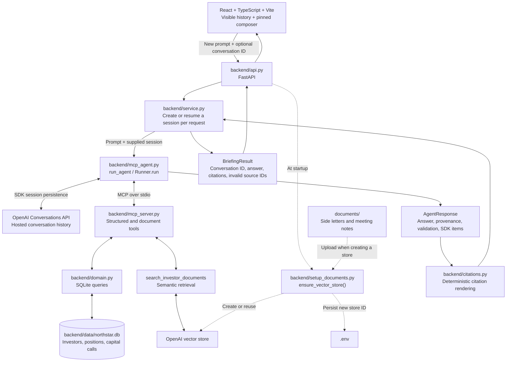

# GP Investor Relations Agent

An AI-assisted application for investor meeting preparation at Northstar Capital,
a fictional private-markets general partner (GP). An investor-relations user can
ask for a briefing that brings together fund positions, capital calls, reporting
obligations and recent meeting context. The local prototype combines deterministic
SQLite-backed data tools and semantic document retrieval through MCP, with source
attribution for both database records and document-backed claims.

## What It Does

The workflow addresses a concrete investor-relations task: gathering financial
records, side-letter obligations and prior discussion points before an investor
meeting. Its scope is read-only briefing preparation for an IR professional to
review.

Use the Northstar web application to prepare a briefing, then open its numbered
citations to inspect the underlying source metadata. A React/TypeScript/Vite page
calls a small FastAPI transport layer; the existing Python service supplies the
answer and full source metadata. Ask follow-up questions in the same workspace;
earlier requests, answers, and their sources remain visible. Use **New conversation**
to start another briefing.

The composer stays pinned to the bottom while the conversation history scrolls
above it. **Enter** sends a request; **Shift+Enter** inserts a line break.
Ctrl/Cmd+Enter also sends. The text box grows to a capped height. New turns follow
the bottom, while scrolling up during a pending reply preserves your reading position.

Earlier turns remain visible during loading and errors. Failed prompts stay
available to edit or retry, without duplicating successful turns. The UI prevents
concurrent submissions and rejects unexpected conversation-ID changes instead of
mixing conversations.

**New conversation** clears local messages, the conversation ID, the prompt, and
source selection. Refreshing also resets the workspace. Neither action deletes
the hosted conversation; the app cannot reopen an earlier conversation yet.

Example questions supported by the included data:

- What are all the investors at Northstar?
- Prepare me for a meeting with Redwood Family Office. Include its investment
  position, outstanding capital calls, special reporting obligations, and most
  recent meeting discussion.
- What outstanding capital calls does Redwood Family Office have?
- What special reporting obligations apply to Beacon University Endowment?
- What did Redwood Family Office discuss in its most recent meeting?

After a Redwood briefing, follow-ups can simply ask "What did they discuss last
time?" or "What special reporting requirements do they have?" React retains the
conversation ID automatically; users do not need to manage it.

The React/FastAPI application is the supported product interface. Evaluation,
setup, and database-reset commands remain developer tools; there is no separate
terminal briefing interface.

## Architecture



For each request, `backend/mcp_agent.py` starts `backend/mcp_server.py` as a subprocess using the
same Python interpreter via `python -m backend.mcp_server`, with its working
directory explicitly set to the repository root. The OpenAI Agents SDK discovers and invokes the
server's tools over standard input/output; the MCP connection closes after the
run. Structured results and retrieved document excerpts return to the agent for
synthesis.

MCP session requests use a 60-second read timeout, including the initialization
handshake, to accommodate slow subprocess startup on small hosted instances.
This also applies to tool responses; it is not a timeout for the entire briefing.

Structured operational data flows from SQLite through `backend/domain.py` functions to
MCP tools. Unstructured investor documents remain in `documents/` and are uploaded
to an OpenAI vector store for semantic retrieval through an MCP tool. The agent
chooses tools and combines their results; the HTTP API calls the
shared service to run the workflow and render its citations.

For a meeting-preparation request, the agent can resolve the investor, retrieve
positions and capital calls, search for relevant side-letter and meeting-note
context, then assemble a briefing. The model selects the tools and their
arguments; the tool implementations determine how the requested data is retrieved.

The two reusable Python boundaries are:

```python
async def generate_briefing(
    prompt: str, *, conversation_id: str | None = None
) -> BriefingResult:
    ...

async def run_agent(
    prompt: str, *, session: Session | None = None
) -> AgentResponse:
    ...
```

The service creates a new `OpenAIConversationsSession` wrapper for each request,
passing the existing ID when supplied. The SDK manages history loading and saving.
The agent runner accepts a generic session and never creates one automatically.
Calling `run_agent(prompt)` without a session remains an independent one-shot run.

## Design Decisions

- **Structured facts through deterministic tools.** `list_investors` enumerates
  all investor records in name order; `find_investor` resolves one investor by name.
  These tools, plus `get_positions` and `get_capital_calls`, use `backend/domain.py`
  to query `backend/data/northstar.db`, with parameterized filters for lookups.
  The model chooses which capabilities
  to invoke; application code supplies the authoritative values for this demo. This keeps financial data
  access behind domain functions rather than asking the model to infer balances
  from prose or giving it arbitrary data access.
- **Document context through retrieval.** `search_investor_documents` uses
  semantic search in an OpenAI vector store for side-letter terms and meeting
  context. It prefixes the query with the investor name, then filters results to
  filenames containing the first word of that name, returning at most three
  matching results. This is simple prototype context scoping, not an
  authorization boundary.
- **MCP as the capability interface.** Both structured tools and document search
  are exposed through the same MCP server. MCP provides tool discovery and
  invocation; domain functions and vector-store search perform the actual data
  access. Business logic remains separate from agent configuration.
- **Source attribution.** MCP results include authoritative database/document
  provenance alongside their `data`. The MCP custom-data extractor captures sources
  from successful tool outputs. `collect_sources(result.new_items)` builds the
  current-run registry, preserving metadata and deduplicating by `source_id`
  with the first occurrence winning. Historical sources and model-written source
  text never populate that registry. Database provenance identifies the database,
  schema, table, and record key; document provenance uses the filename and file ID
  returned by search. The agent uses `[[cite:source_id]]` markers, validated against
  sources returned during that run. Python assigns numbers in order of first citation,
  reuses numbers for repeated sources, and displays invalid references as
  `[citation unavailable]`. Only cited sources appear in the rendered citation
  list. Numbering restarts for each answer. This validates source identity, not claim support.
- **Reuse across entry points.** `backend.service.generate_briefing(prompt, conversation_id=None)` returns a
  `BriefingResult` with `conversation_id`, `answer`, `citations`, and `invalid_source_ids`. Each
  citation preserves the full authoritative source object. Use
  `dataclasses.asdict(result)` for a JSON-ready dictionary. The web API uses this
  boundary; evaluations continue to inspect the raw
  `run_agent()` response.
- **Optional agent sessions.** Python callers can supply an SDK `Session` to
  `run_agent(prompt, session=session)`. `OpenAIConversationsSession` stores history
  in OpenAI's Conversations API; reconstruct it with
  `OpenAIConversationsSession(conversation_id=session.session_id)` to resume.
  Old dialogue supplies conversational context, with assistant citation markers
  stripped and tool calls, outputs, reasoning, and other execution artifacts
  excluded from replayed model input. Stored history is unchanged; current input
  items are preserved. The agent is instructed to retrieve fresh factual evidence
  and cite its own MCP results; Python validates source membership for that run.
  The service creates a new wrapper for each HTTP request, using the supplied
  conversation ID to resume hosted history. No session objects or transcripts
  are retained between requests in FastAPI process memory, so another backend
  worker with access to the same OpenAI project can handle a follow-up. This
  supports future multiple-worker deployment; it does not configure one.
  Evaluation trials remain
  independent one-shot calls to `run_agent(prompt)`.
  A small callback adapter handles SDK 0.22.2's history bookkeeping so sanitized
  old messages are not saved again as new turns.
- **Visible conversation in React.** The page retains the opaque conversation ID
  and each successful user/assistant turn in React state. Follow-ups send only the
  new prompt and ID, never the visible transcript. FastAPI restores OpenAI-hosted
  context and retrieves fresh MCP evidence for each factual turn. Each answer
  keeps its own citations; earlier turns stay visible during loading or errors.
  **New conversation** resets local state without deleting hosted history.
- **Citation presentation in React.** The page renders Markdown with
  `react-markdown` and GFM support, turning matching `[n]` text references into
  buttons for the backend's exact citation object. It never renumbers or repairs
  citations. Code and links remain unchanged; raw HTML is not rendered. A
  shadcn-style Radix Dialog sheet supplies keyboard dismissal and focus handling.
  Labels come only from source metadata: record keys, fund names, or humanized
  filenames and valid dates encoded in them. Investor metadata currently has an
  ID but no name, so its label is `Investor Record — INV-001`. Missing provenance
  is not invented; the source drawer displays the fields actually returned.
  Opening a citation does not download an original document or query a database
  record. Each assistant turn retains its own `RenderedResponse`; the HTTP
  `BriefingResponse` type adds the conversation ID without changing presentation types.

## Data and Documents

**All business data is synthetic. Northstar Capital and every investor are
fictional.** [backend/data/northstar.db](backend/data/northstar.db) stores investor IDs, names and
types; positions in Northstar Growth Fund II with commitment, contributed and
unfunded amounts; and capital calls with amounts, due dates and statuses.

| Investor | Structured coverage | Documents |
| --- | --- | --- |
| Redwood Family Office | Investor record, fund position, outstanding capital call | [Side letter](documents/redwood_side_letter.md); [August 14, 2026 meeting notes](documents/redwood_meeting_notes_2026_08_14.md) |
| Beacon University Endowment | Investor record, fund position, paid capital call | [Side letter](documents/beacon_side_letter.md); [July 20, 2026 meeting notes](documents/beacon_meeting_notes_2026_07_20.md) |
| Atlas Pension Fund | Investor record only; no position or capital-call records | None |

The four Markdown documents contain reporting obligations and meeting discussion
context. To inspect an answer, compare financial values with the SQLite database
(or its synthetic seed data in [backend/create_database.py](backend/create_database.py)) and
document-derived claims with the cited files in [documents/](documents/).
The agent is instructed to acknowledge unavailable information.

## Project Structure

```text
backend/
  __init__.py          Python application package
  api.py               FastAPI validation, startup, and service transport
  service.py           Per-request session wrapper and BriefingResult
  citations.py         Deterministic rendering of validated citations
  mcp_agent.py         Agent execution, history filtering, and provenance validation
  mcp_server.py        MCP tools for structured records and document search
  domain.py            SQLite data-access functions
  paths.py             Shared backend and repository resource paths
  data/northstar.db    Existing synthetic operational records
  create_database.py   Optional database recreation/reset with seed data
  setup_documents.py   Reuses or creates a store; saves new ID to root .env
frontend/
  src/App.tsx          Visible turns, scrollable history, pinned composer
  src/api/briefings.ts Configurable HTTP client
  src/types/briefing.ts Presentation and HTTP response types
  src/components/     Briefing, SourceDrawer, and dialog components
  src/sources.ts      Source labels and metadata detail rows
  src/styles.css      Northstar visual styling
  .env.example        Public API URL example
documents/             Synthetic side letters and meeting notes
evals/
  cases.json          Deterministic output, amount, and tool-call assertions
  run_evals.py        Independent sequential agent trials
  results/            Generated JSON reports (gitignored)
tests/                 Offline Python tests
Dockerfile             Python backend image
.dockerignore          Docker build-context exclusions
requirements.txt       Python dependencies
.env.example           Configuration placeholders; .env remains at root
.gitignore             Excludes environments, secrets, and generated files
```

All shared paths are resolved in `backend/paths.py` from the package location.
The root `.env` and `documents/` stay in place; SQLite lives in `backend/data/`.
Run Python entry points from the repository root with `python -m backend.<module>`,
such as `backend.setup_documents` for document-store setup.

## Running Locally

Use Python 3.10+ and Node.js 22.12+ (the frontend's declared minimum).
The Docker image uses Python 3.12. Session behavior has been verified against
`openai-agents==0.22.2`; Python dependencies are not currently pinned.

The commands below use PowerShell. In other shells, use the corresponding
virtual-environment activation command and `npm` in place of `npm.cmd`.

```powershell
git clone https://github.com/HectorFraireSanchez/gp-investor-relations-agent.git
cd gp-investor-relations-agent
python -m venv .venv
.\.venv\Scripts\Activate.ps1
python -m pip install -r requirements.txt
if (-not (Test-Path .env)) { Copy-Item .env.example .env }
```

Edit `.env` to add your own API key. Leave the vector-store ID blank on first setup:

```dotenv
OPENAI_API_KEY=your-openai-api-key
OPENAI_VECTOR_STORE_ID=
CORS_ALLOW_ORIGINS=http://localhost:5173,http://127.0.0.1:5173
```

Start the web backend from the repository root with the Python environment active:

```powershell
python -m uvicorn backend.api:app --reload --loop backend.api:create_event_loop
```

In a second terminal, start the frontend:

```powershell
cd frontend
npm.cmd install
npm.cmd run dev
```

Install frontend dependencies initially and when they change. Later starts only
need `npm.cmd run dev`. `npm.cmd` avoids PowerShell's `npm.ps1` execution-policy
issue without changing the execution policy. Press Ctrl+C in each server's
terminal to stop it.

Run one backend on port 8000 at a time. If the Docker backend is running, use
`docker stop northstar-backend` before starting local Uvicorn.

The explicit loop factory keeps MCP subprocesses working with Uvicorn's reload
mode on Windows, where its default reload loop does not support subprocesses.
It uses the standard asyncio loop on other platforms. Without reload,
`python -m uvicorn backend.api:app` also works on Windows.

Open `http://localhost:5173`. The Vite server uses a fixed port so it matches the
API's local CORS allowlist (`localhost:5173` and `127.0.0.1:5173`). Requests default
to `http://localhost:8000`; to change that origin, copy `frontend/.env.example` to
`frontend/.env.local`, set `VITE_API_BASE_URL`, and restart Vite. Only the public
API origin belongs there. OpenAI credentials stay in the repository-root `.env`
on the Python backend and must never appear in `VITE_` variables.

The API client sends requests directly; there is no Vite development proxy.
For a deployed backend, set `VITE_API_BASE_URL` to its public base URL **before
building the frontend**. Vite embeds this value in the build, so changing it
requires rebuilding (or restarting Vite during development).

The backend reads `CORS_ALLOW_ORIGINS` as a comma-separated list of exact frontend
origins. It defaults to the two local origins above; add the real frontend origin
when deploying and restart the backend. No wildcard or production origin is
enabled by default. Only GET/POST and the Content-Type request header are allowed.

`GET http://localhost:8000/health` returns `{"status":"ok"}` without calling the
agent or OpenAI. Normal application startup still initializes the document store
before accepting requests; this endpoint reports service liveness, not upstream
API health.

`POST /api/briefings` accepts `{"prompt": "Prepare me for Redwood."}` to start an
OpenAI-hosted conversation. It returns flat JSON with `conversation_id`, `answer`,
`citations` (each with `number`, `source_id`, and the complete `source` object),
and `invalid_source_ids`. Send the returned ID on a later request:

```json
{"prompt": "What did they discuss last time?", "conversation_id": "<returned ID>"}
```

Omitting the ID (or sending `null`) starts a new conversation. A supplied ID must
be a nonblank string of at most 256 characters; it is otherwise treated as opaque.
Each request retrieves fresh MCP evidence and validates citations against its own
tool results. React handles the conversation ID automatically as users ask
follow-up questions; users do not need to manage it. Empty,
non-string, blank, or over-10,000-character prompts return HTTP 422, as do invalid
conversation IDs and unknown extra request fields. Generation errors, including
upstream conversation errors, return a generic HTTP 502 with diagnostics logged
on the backend rather than exposed to clients. API
documentation is available at `http://127.0.0.1:8000/docs`.

At startup, the API lifespan calls `ensure_vector_store()` from
`backend/setup_documents.py` once per process, before handling requests.
It reuses the configured store if it exists. If no ID is configured, or OpenAI
reports that the configured store was not found, it creates a store, uploads the
files in `documents/`, waits for indexing, and saves `OPENAI_VECTOR_STORE_ID` in
`.env` and the running process. Initial startup may take longer while documents
are indexed. No manual document-setup command, ID copying, or PowerShell
environment-variable exports are needed.

The MCP server starts automatically; no separate server command is needed.

For later runs, activate `.venv` and start the backend and frontend as above.
Backend configuration is loaded from `.env`. That file is intentionally git-ignored, and `.env.example` contains
placeholders only. Each user supplies their own OpenAI credentials and store.
Access to the model, Conversations API, and vector-store operations is required
for live use. Setup errors other than a missing store propagate and prevent API
startup. To initialize documents without starting the API, run
`python -m backend.setup_documents`.

Normal startup uses the existing `backend/data/northstar.db`. To recreate a missing
database or reset it to the synthetic seed data, optionally run
`python -m backend.create_database`. This deletes and replaces the existing database;
the app does not initialize SQLite automatically.

OpenAI API usage may incur charges and is
[billed separately from ChatGPT subscriptions](https://help.openai.com/en/articles/9039756-managing-billing-settings-on-chatgpt-web-and-platform).

## Running the Backend in Docker

Docker packages only the Python backend, its SQLite database, and the synthetic
documents. The frontend still runs separately with Vite.

With Docker Desktop running and a configured root `.env`, run from the repository root:

```powershell
docker build -t northstar-backend .
docker run -d --name northstar-backend --env-file .env -p 127.0.0.1:8000:8000 northstar-backend
docker logs -f northstar-backend
```

Docker's `--env-file` expects unquoted `KEY=value` entries. Ctrl+C stops following
the logs while the detached container keeps running. Check
http://localhost:8000/health after startup, then start Vite as described above.

To replace an existing container after backend changes:

```powershell
docker build -t northstar-backend .
docker stop northstar-backend
docker rm northstar-backend
docker run -d --name northstar-backend --env-file .env -p 127.0.0.1:8000:8000 northstar-backend
```

The image uses `python:3.12-slim-bookworm`, installs `requirements.txt`, runs as a
non-root user, and starts Uvicorn on port 8000. `.dockerignore` excludes secrets,
local environments, frontend files, tests, and evaluation artifacts.

`--env-file` passes configuration into the container; it does not mount the host
file. A new vector-store ID generated inside Docker is saved to `/app/.env` in
that container, not to the host `.env`. Recreating the container with a blank or
stale host ID creates another store. Configure a valid existing ID on the host
to reuse it. These commands configure no volumes or host-code mounts; code and
bundled data changes require rebuilding the image.

## Tests and Agent Evaluations

Run the offline Python tests from the repository root with `.venv` active:

```powershell
python -m unittest discover -s tests -v
```

Coverage includes session filtering and SDK persistence bookkeeping, new/resumed
service sessions, HTTP validation and safe errors, CORS and health, citation
rendering, resource paths, and a real local MCP subprocess without model calls.

Check the frontend without API access:

```powershell
cd frontend
npm.cmd test
npm.cmd run typecheck
npm.cmd run build
```

The frontend tests cover conversation-ID reuse, per-turn citation identity,
source labels, drawer focus, loading, retry/reset behavior, unexpected ID changes,
keyboard submission, and API URL configuration. The production build goes into
`frontend/dist/`; the backend Docker image does not serve it.

Run agent evaluations separately from the repository root with API access and
an initialized document store:

```powershell
python evals/run_evals.py
```

The harness currently runs **9 cases with 5 sequential trials each**. Cases cover
positions, outstanding/paid calls, reporting requirements, meeting history,
missing records, combined structured queries, full briefing preparation, and
complete investor enumeration with all three investor sources retrieved and cited.
Each trial calls `run_agent(prompt)` without a session. Trials remain independent,
with no concurrency or retry loop, and do not perform the API's document setup.

| Assertion | Check |
| --- | --- |
| `must_contain` / `must_not_contain` | Case-insensitive substrings of raw final output |
| `must_contain_amounts` | Numeric equivalence using `Decimal` |
| `required_tools` / `forbidden_tools` | Exact tool names from current SDK `ToolCallItem` records |
| `required_source_ids` | Exact IDs in the authoritative current-run source registry |
| `required_citation_ids` | Exact cited IDs that also belong to the current-run registry |

Amount matching recognizes optional `$`, commas, decimals, and case-insensitive
`k`/`thousand`, `m`/`million`, and `b`/`billion` suffixes. For example, `$5M`,
`5,000,000`, and `5 million` satisfy an expected amount of `5000000`. It does not
parse written-out numbers or associate a matched amount with a particular field.
Ordinary text assertions, including `must_not_contain`, retain substring semantics.

A trial passes only when the run completes and all checks pass. Errors are
recorded and later trials continue. Per-case pass rate is passed trials divided
by total trials; the overall report includes the same trial ratio and aggregate
check counts. Exit status is 0 only when all trials pass, otherwise 1.

Each full run creates one UTC-timestamped JSON file under `evals/results/`, with
microseconds in the filename. It contains run settings and summaries, plus every
case's trials: raw output, observed tools, source IDs, cited source IDs, check
results, pass/fail, and errors.
The directory is created automatically and is gitignored. Inspect individual
failures, adjust the appropriate code or case expectations, and rerun to assess
consistency. Assertions are deterministic; model answers and tool selection are not.

## Technology

React, TypeScript, Vite, Tailwind CSS, Radix Dialog (shadcn-style sheet),
react-markdown, FastAPI, Uvicorn, Python, OpenAI Agents SDK, Model Context Protocol
(MCP) Python SDK, OpenAI API and vector stores, SQLite, and python-dotenv.

## Current Scope and Limitations

- A portfolio prototype with a small synthetic dataset and local execution.
  Operational records
  are synthetic SQLite records, with no connection to a live fund-administration
  system.
- Reusing an existing vector store does not synchronize changes to local documents.
- No application authentication, authorization or tenant isolation. Filename
  filtering only narrows retrieved context.
- Responses and tool selection are model-driven. Instructions request source
  citations and acknowledgement of missing data; they do not guarantee factual
  or citation correctness.
- Evaluations check raw output, numeric amounts, and tool names across repeated
  trials. They do not assert tool arguments or order, or establish whether a cited
  source supports a claim. There is no LLM grader or latency/token/cost tracking.
- Python dependencies are unpinned. The session callback uses SDK behavior verified
  against version 0.22.2; run the SDK regression tests when changing dependencies.
  Frontend dependency versions are recorded in `frontend/package-lock.json`.
- Hosted history can contain tool calls and outputs even though replay filtering
  excludes them from subsequent model input. No history compaction or
  application-level retention controls are implemented.
- Requests are non-streaming. Visible turns and the conversation ID are kept only
  in React state; refreshing resets the workspace. Hosted model history persists,
  but restoring a previous workspace is not yet supported. The web layer adds no
  authentication. Docker packages the backend, while frontend hosting, deployment
  orchestration, and CI/CD remain outside the repository's setup. Keep this local
  prototype on the default loopback hosts.

## What This Project Demonstrates

- Scoping a private-markets operational task into a working local briefing
  application with concrete data requirements and example requests.
- Connecting a web page, HTTP service, async agent orchestration and MCP tools across
  the application workflow.
- Designing context from two sources: deterministic financial records and
  retrieved investor documents, with source metadata preserved for inspection.
- Separating the agent workflow from citation presentation and future clients.
- Maintaining hosted conversation context across stateless HTTP requests while
  keeping factual provenance isolated to each agent run.
- Improving agent behavior through repeated deterministic evaluations of amounts,
  final answers, and actual tool calls.
- Documenting setup, dataset coverage and limitations so another developer can
  run and inspect the prototype with their own credentials.
