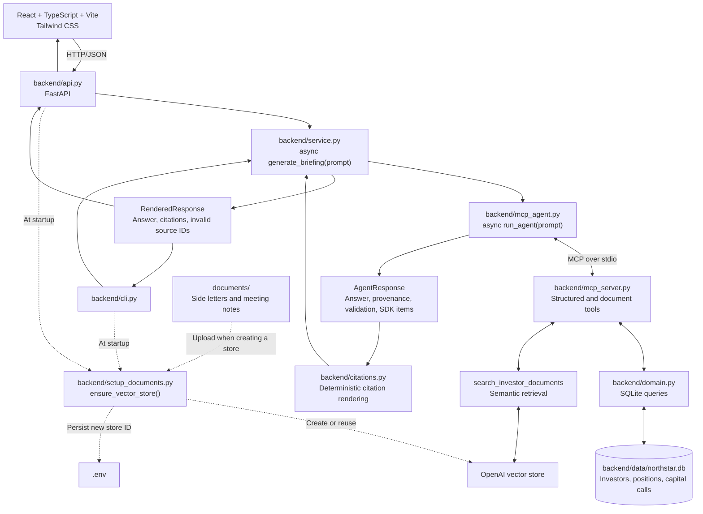

# GP Investor Relations Agent

An AI-assisted application for investor meeting preparation at Northstar Capital,
a fictional private-markets general partner (GP). An investor-relations user can
ask for a briefing that brings together fund positions, capital calls, reporting
obligations and recent meeting context. The local prototype combines deterministic
SQLite-backed data tools and semantic document retrieval through MCP, with source
attribution for document-backed claims.

## What It Does

The workflow addresses a concrete investor-relations task: gathering financial
records, side-letter obligations and prior discussion points before an investor
meeting. Its scope is read-only briefing preparation for an IR professional to
review.

Use the Northstar web application to prepare a briefing, then open its numbered
citations to inspect the underlying source metadata. A React/TypeScript/Vite page
calls a small FastAPI transport layer; the existing Python service supplies the
answer and full source metadata. The CLI remains available for the same workflow.

Example questions supported by the included data:

- Prepare me for a meeting with Redwood Family Office. Include its investment
  position, outstanding capital calls, special reporting obligations, and most
  recent meeting discussion.
- What outstanding capital calls does Redwood Family Office have?
- What special reporting obligations apply to Beacon University Endowment?
- What did Redwood Family Office discuss in its most recent meeting?

## Architecture



For each request, `backend/mcp_agent.py` starts `backend/mcp_server.py` as a subprocess using the
same Python interpreter via `python -m backend.mcp_server`, with its working
directory explicitly set to the repository root. The OpenAI Agents SDK discovers and invokes the
server's tools over standard input/output; the MCP connection closes after the
run. Structured results and retrieved document excerpts return to the agent for
synthesis.

Structured operational data flows from SQLite through `backend/domain.py` functions to
MCP tools. Unstructured investor documents remain in `documents/` and are uploaded
to an OpenAI vector store for semantic retrieval through an MCP tool. The agent
chooses tools and combines their results; both the CLI and HTTP API call the
shared service to run the workflow and render its citations.

For a meeting-preparation request, the agent can resolve the investor, retrieve
positions and capital calls, search for relevant side-letter and meeting-note
context, then assemble a briefing. The model selects the tools and their
arguments; the tool implementations determine how the requested data is retrieved.

## Design Decisions

- **Structured facts through deterministic tools.** `find_investor`,
  `get_positions`, and `get_capital_calls` call `backend/domain.py` functions that query
  `backend/data/northstar.db` using parameterized SQL. The model chooses which capabilities
  to invoke; application code supplies the authoritative values for this demo. This keeps financial data
  access behind domain functions rather than asking the model to infer balances
  from prose or giving it arbitrary data access.
- **Document context through retrieval.** `search_investor_documents` uses
  semantic search in an OpenAI vector store for side-letter terms and meeting
  context. It prefixes the query with the investor name, then filters results to
  filenames containing the first word of that name, returning at most three
  matching results. This is simple prototype context scoping, not an
  authorization boundary.
- **MCP as the capability interface.** Both structured tools and document search
  are exposed through the same MCP server. MCP provides tool discovery and
  invocation; domain functions and vector-store search perform the actual data
  access. Business logic remains separate from agent configuration.
- **Source attribution.** MCP results include authoritative database/document
  provenance. The agent uses `[[cite:source_id]]` markers, validated against sources
  returned during that run. Python assigns numbers in order of first citation,
  reuses numbers for repeated sources, and displays invalid references as
  `[citation unavailable]`. This validates source identity, not claim support.
- **Reuse across entry points.** `backend.service.generate_briefing(prompt)` returns a
  `RenderedResponse` with `answer`, `citations`, and `invalid_source_ids`. Each
  citation preserves the full authoritative source object. Use
  `dataclasses.asdict(result)` for a JSON-ready dictionary. The CLI uses this
  boundary, as does the web API; evaluations continue to inspect the raw
  `run_agent()` response.
- **Citation presentation in React.** The page renders Markdown with
  `react-markdown` and GFM support, turning matching `[n]` text references into
  buttons for the backend's exact citation object. It never renumbers or repairs
  citations. Code and links remain unchanged; raw HTML is not rendered. A
  shadcn-style Radix Dialog sheet supplies keyboard dismissal and focus handling.
  Labels come only from source metadata: record keys, fund names, or humanized
  filenames and valid dates encoded in them. Investor metadata currently has an
  ID but no name, so its label is `Investor Record — INV-001`. Missing provenance
  is not invented; the source drawer displays the fields actually returned.

## Data and Documents

**All business data is synthetic. Northstar Capital and every investor are
fictional.** [backend/data/northstar.db](backend/data/northstar.db) stores investor IDs, names and
types; positions in Northstar Growth Fund II with commitment, contributed and
unfunded amounts; and capital calls with amounts, due dates and statuses.

| Investor | Structured coverage | Documents |
| --- | --- | --- |
| Redwood Family Office | Investor record, fund position, outstanding capital call | [Side letter](documents/redwood_side_letter.md); [August 14, 2026 meeting notes](documents/redwood_meeting_notes_2026_08_14.md) |
| Beacon University Endowment | Investor record, fund position, paid capital call | [Side letter](documents/beacon_side_letter.md); [July 20, 2026 meeting notes](documents/beacon_meeting_notes_2026_07_20.md) |
| Atlas Pension Fund | Investor record only; no position or capital-call records | None |

The four Markdown documents contain reporting obligations and meeting discussion
context. To inspect an answer, compare financial values with the SQLite database
(or its synthetic seed data in [backend/create_database.py](backend/create_database.py)) and
document-derived claims with the cited files in [documents/](documents/).
The agent is instructed to acknowledge unavailable information.

## Project Structure

```text
backend/
  __init__.py          Python application package
  api.py               FastAPI validation, startup, and service transport
  cli.py               Command-line entry point and document-store setup
  service.py           Frontend-independent briefing service
  citations.py         Deterministic rendering of validated citations
  mcp_agent.py         Async agent entry point and MCP client setup
  mcp_server.py        MCP tools for structured records and document search
  domain.py            SQLite data-access functions
  paths.py             Shared backend and repository resource paths
  data/northstar.db    Existing synthetic operational records
  create_database.py   Optional database recreation/reset with seed data
  setup_documents.py   Reuses or creates a store; saves new ID to root .env
  test_search.py       Manual vector-store search inspection
  function_agent.py    Earlier direct function-tool example
frontend/              React/TypeScript/Vite browser application
documents/             Synthetic side letters and meeting notes
evals/                 Raw agent evaluations and generated results
tests/                 Offline Python tests
requirements.txt       Python dependencies
.env.example           Configuration placeholders; .env remains at root
.gitignore             Excludes environments, secrets, and generated files
```

All shared paths are resolved in `backend/paths.py` from the package location.
The root `.env` and `documents/` stay in place; SQLite lives in `backend/data/`.
Run Python entry points from the repository root with `python -m backend.<module>`,
including `backend.setup_documents` and the manual `backend.test_search`.

## Running Locally

Use Python 3.10+, Node.js 22.12+ (Node 22 LTS recommended), and PowerShell:

```powershell
git clone https://github.com/HectorFraireSanchez/gp-investor-relations-agent.git
cd gp-investor-relations-agent
python -m venv .venv
.\.venv\Scripts\Activate.ps1
python -m pip install -r requirements.txt
Copy-Item .env.example .env
```

Edit `.env` to add your own API key. Leave the vector-store ID blank on first setup:

```dotenv
OPENAI_API_KEY=your-openai-api-key
OPENAI_VECTOR_STORE_ID=
```

Start the web backend from the repository root with the Python environment active:

```powershell
python -m uvicorn backend.api:app --reload --loop backend.api:create_event_loop
```

In a second terminal, start the frontend:

```powershell
cd frontend
npm install
npm run dev
```

The explicit loop factory keeps MCP subprocesses working with Uvicorn's reload
mode on Windows, where its default reload loop does not support subprocesses.
It uses the standard asyncio loop on other platforms. Without reload,
`python -m uvicorn backend.api:app` also works on Windows.

Open `http://localhost:5173`. The Vite server uses a fixed port so it matches the
API's local CORS allowlist (`localhost:5173` and `127.0.0.1:5173`). Requests default
to `http://127.0.0.1:8000`; to change that origin, copy `frontend/.env.example` to
`frontend/.env.local`, set `VITE_API_BASE_URL`, and restart Vite. Only the public
API origin belongs there. OpenAI credentials stay in the repository-root `.env`
on the Python backend and must never appear in `VITE_` variables.

`POST /api/briefings` accepts `{"prompt": "Prepare me for Redwood."}` and returns
the existing `RenderedResponse` as JSON: `answer`, `citations` (each with `number`,
`source_id`, and the complete `source` object), and `invalid_source_ids`. Empty,
non-string, blank, or over-10,000-character prompts return HTTP 422. Generation
errors return a generic HTTP 502, with diagnostics logged on the backend. API
documentation is available at `http://127.0.0.1:8000/docs`.

The CLI is also available:

```powershell
python -m backend.cli "Prep me for my meeting with Redwood Family Office."
```

At startup, the API lifespan (or `backend/cli.py`) calls `ensure_vector_store()` from
`backend/setup_documents.py` once per process, before handling requests.
It reuses the configured store if it exists. If no ID is configured, or OpenAI
reports that the configured store was not found, it creates a store, uploads the
files in `documents/`, waits for indexing, and saves `OPENAI_VECTOR_STORE_ID` in
`.env` and the running process. Initial startup may take longer while documents
are indexed. No manual document-setup command, ID copying, or PowerShell
environment-variable exports are needed.

The CLI prints the rendered answer and its numbered source list, then exits.
The MCP server starts automatically; no separate server command is needed.

For later runs, activate `.venv` and run `python -m backend.cli "Your question"`; configuration is loaded
from `.env`. That file is intentionally git-ignored, and `.env.example` contains
placeholders only. Each user supplies their own OpenAI credentials and store.

Normal startup uses the existing `backend/data/northstar.db`. To recreate a missing
database or reset it to the synthetic seed data, optionally run
`python -m backend.create_database`. This deletes and replaces the existing database;
the app does not initialize SQLite automatically.

OpenAI API usage may incur charges and is
[billed separately from ChatGPT subscriptions](https://help.openai.com/en/articles/9039756-managing-billing-settings-on-chatgpt-web-and-platform).

Run the deterministic tests without API calls:

```powershell
python -m unittest discover -s tests -v
```

Run raw agent evaluations with API access and a configured vector store:

```powershell
python evals/run_evals.py
```

Check the frontend without API access:

```powershell
cd frontend
npm test
npm run typecheck
npm run build
```

The frontend tests cover citation identity/repetition, source labels, source
drawer interaction and focus, request states, and HTTP errors. The production
build goes into `frontend/dist/`; serving/deploying it is outside this local
two-process setup. The raw evaluation command above remains unchanged.

## Technology

React, TypeScript, Vite, Tailwind CSS, Radix Dialog (shadcn-style sheet),
react-markdown, FastAPI, Uvicorn, Python, OpenAI Agents SDK, Model Context Protocol
(MCP) Python SDK, OpenAI API and vector stores, SQLite, and python-dotenv.

## Current Scope and Limitations

- A portfolio prototype with a small synthetic dataset and local execution.
  Operational records
  are synthetic SQLite records, with no connection to a live fund-administration
  system.
- Reusing an existing vector store does not synchronize changes to local documents.
- No application authentication, authorization or tenant isolation. Filename
  filtering only narrows retrieved context.
- Responses and tool selection are model-driven. Instructions request source
  citations and acknowledgement of missing data; they do not guarantee factual
  or citation correctness.
- Evaluations check raw output, numeric amounts, and tool calls across repeated
  trials; they do not establish whether a cited source supports a claim.
  `backend/test_search.py` remains a manual retrieval inspection script. Python dependencies
  are currently unpinned; frontend dependency versions are recorded in its lockfile.
- Requests are non-streaming and briefings are kept only in page memory. Reloading
  clears them. The web layer adds no authentication, conversation history, or
  deployment infrastructure; keep this local prototype on the default loopback hosts.

## What This Project Demonstrates

- Scoping a private-markets operational task into a working local briefing
  application with concrete data requirements and example requests.
- Connecting a web page, HTTP service, CLI, async agent orchestration and MCP tools across
  the application workflow.
- Designing context from two sources: deterministic financial records and
  retrieved investor documents, with source metadata preserved for inspection.
- Separating the agent workflow from citation presentation and future clients.
- Documenting setup, dataset coverage and limitations so another developer can
  run and inspect the prototype with their own credentials.
