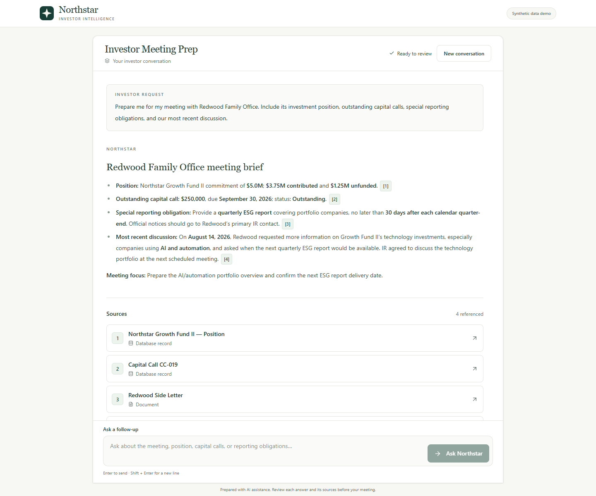
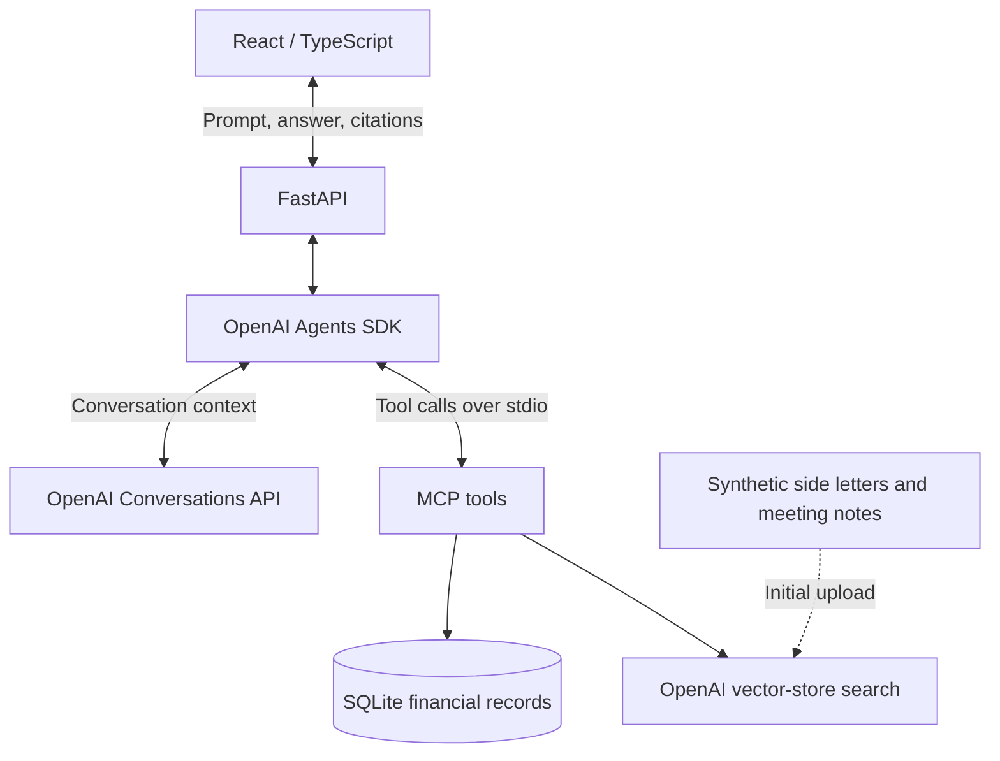

# Northstar Investor Intelligence

**Live demo: [Try Northstar](https://northstar-h9q9.onrender.com/)**

Northstar helps investor-relations professionals at a private-market fund manager prepare for investor conversations. Built around fictional Northstar Capital, it brings together financial records, reporting obligations, and past meeting notes into a briefing with citations. All investors, documents, and financial data are synthetic.



## What it does

- **Prepare for a meeting:** combine an investor's fund position, capital calls, side-letter obligations, and recent discussions.
- **Ask follow-up questions:** retain conversational context while retrieving fresh evidence for each answer.
- **Inspect sources:** open numbered citations to see the database record or document metadata returned by the tools.

Try **"Prepare me for my meeting with Redwood Family Office"**, then **"What special reporting requirements do they have?"** The workflow is read-only; it does not change records, send messages, or execute transactions.

## How it works

A React interface sends each prompt to FastAPI. The OpenAI Agents SDK runs the model and exposes business-data and document-search capabilities through **Model Context Protocol (MCP)** tools. Financial records come from SQLite queries; document passages come from semantic search over an OpenAI vector store.



The main design decisions are:

- **Separate business logic from model orchestration.** Parameterized queries in [backend/domain.py](backend/domain.py) retrieve structured facts. The agent chooses tools and synthesizes their results; it does not generate SQL.
- **Validate citation provenance per answer.** Tools return data together with source metadata. The backend collects sources from the current run, validates citation IDs against that registry, and renders numbered references. Unknown IDs become `[citation unavailable]`. This verifies source identity, not whether a source supports every claim.
- **Retain context without reusing old evidence.** Hosted conversations preserve dialogue. Before a follow-up, the backend removes old tool outputs and assistant citation markers from replayed context, and instructs the agent to retrieve facts again. Each answer has its own source registry.
- **Reuse the MCP connection.** FastAPI starts one MCP subprocess per worker, discovers its tools, and closes it at shutdown. Agents, sessions, and source registries remain separate for each request.

**Stack:** Python, FastAPI, OpenAI Agents SDK, MCP, SQLite, OpenAI vector stores and Conversations API; React, TypeScript, Vite, Tailwind CSS, and Radix Dialog. Render hosts the static frontend and Docker-based backend separately.

## Testing and evaluation

Offline tests cover API validation and errors, conversation persistence, citation rendering, document scoping, and a real MCP subprocess. They also exercise concurrent requests, cancellation, and connection reuse. Frontend tests cover follow-ups, per-answer citations, source-drawer focus, retries, resets, and keyboard interaction.

The [evaluation harness](evals/run_evals.py) runs **9 cases with 5 independent trials each**, using real model calls. [Cases](evals/cases.json) cover investor enumeration, positions, outstanding and paid calls, reporting obligations, meeting history, missing records, and full meeting preparation. Assertions check:

- Required and forbidden answer content.
- Financial amounts normalized with `Decimal`, including forms such as `$5M` and `5,000,000`.
- Required and forbidden tools, taken from actual SDK call records.
- Required source IDs and citations belonging to the current run, where configured.

**Verified on September 15, 2026 (UTC):** 54 Python tests passed on Python 3.14 and in the Python 3.12 Docker image; 23 frontend tests, TypeScript checks, and the production build passed. Clean Python and frontend installs also passed.

The full evaluation run passed **43/45 trials and 818/820 checks**. Two trials of the combined position-and-capital-calls question unnecessarily called document search; all answer-content and amount checks passed. The strict tool-selection checks remain in place. These results describe this run, not a guarantee of future model behavior.

Run offline checks from the repository root with the Python environment active:

```sh
python -m unittest discover -s tests -v
npm --prefix frontend test
npm --prefix frontend run typecheck
npm --prefix frontend run build
```

Run evaluations after configuring OpenAI and initializing the document store:

```sh
python -m backend.setup_documents
python evals/run_evals.py
```

Evaluations incur API usage. Timestamped reports in the ignored `evals/results/` directory retain each answer, tool calls, source IDs, assertions, and errors. The runner exits nonzero when any trial fails. Checks do not assess every claim's meaning or associate each matched amount with a specific field.

Backend JSON timing logs separate model calls, tool calls, conversation loading/saving, and citation processing. Use `request_id` to group a request and `duration_ms` to inspect each stage. Parent timings include their children; do not add them together. The timing records omit prompts, answers, and credentials.

## Run locally

Use **Python 3.12 or 3.14** and **Node.js 22.12+**; Node 24.19 was used for verification. Docker is optional for local development. An OpenAI API key with access to model calls and vector stores is required.

**1. Install the backend dependencies.** From the repository root:

```sh
python -m venv .venv
```

Activate the environment with `source .venv/bin/activate` on macOS/Linux or `.venv\Scripts\Activate.ps1` in Windows PowerShell, then run:

```sh
python -m pip install -r requirements.txt
```

If PowerShell blocks activation, use `.venv\Scripts\python.exe` in place of `python`; use `npm.cmd` in place of `npm` if it blocks the npm PowerShell wrapper.

**2. Configure the backend.** Copy [.env.example](.env.example) to `.env` and set `OPENAI_API_KEY`. Leave `OPENAI_VECTOR_STORE_ID` blank to create a store from [documents/](documents/), or provide an existing store containing these documents.

```sh
python -m backend.setup_documents
python -m uvicorn backend.api:app --host 127.0.0.1 --port 8000
```

Document setup uploads and indexes the files when creating a store, then saves its ID to `.env`. Backend startup also runs this check. Existing stores are reused without synchronizing local document edits.

Check [localhost:8000/health](http://localhost:8000/health) after startup. The bundled [SQLite database](backend/data/northstar.db) is ready to use. `python -m backend.create_database` resets it to the synthetic seed data if needed.

**3. Start the frontend** in another terminal:

```sh
cd frontend
npm ci
npm run dev
```

Open [localhost:5173](http://localhost:5173). The frontend defaults to `http://localhost:8000`; copy [frontend/.env.example](frontend/.env.example) to `frontend/.env.local` to change `VITE_API_BASE_URL`. Vite embeds this public value at build time. Keep the OpenAI key in the backend environment.

For the deployed arrangement, Render serves `frontend/dist/` after `npm ci && npm run build` in `frontend/`. Its `VITE_API_BASE_URL` points to the backend, and the backend's `CORS_ALLOW_ORIGINS` allows the exact frontend origin. The [Dockerfile](Dockerfile) packages the backend on Python 3.12 and listens on port 8000 as a non-root user. Deployment settings are managed in Render.

## Scope and source layout

This is a small synthetic demo without authentication, authorization, or tenant isolation. Document filename filtering scopes retrieval to an investor; it is not an access-control boundary. Answers and tool selection remain model-dependent and need human review.

The UI keeps its visible conversation in memory. Refreshing or choosing **New conversation** resets the workspace but does not delete the hosted conversation. Reopening past conversations and history compaction are not implemented. Responses arrive when the full request completes; they are not streamed. A failed MCP subprocess requires a worker restart.

| Directory | Purpose |
| --- | --- |
| [backend/](backend/) | HTTP API, agent orchestration, MCP tools, data access, citations, and timing |
| [frontend/](frontend/) | React conversation interface and source drawer |
| [documents/](documents/) | Synthetic side letters and meeting notes |
| [tests/](tests/) | Offline Python regression tests |
| [evals/](evals/) | Repeated agent evaluations and expected behavior |
